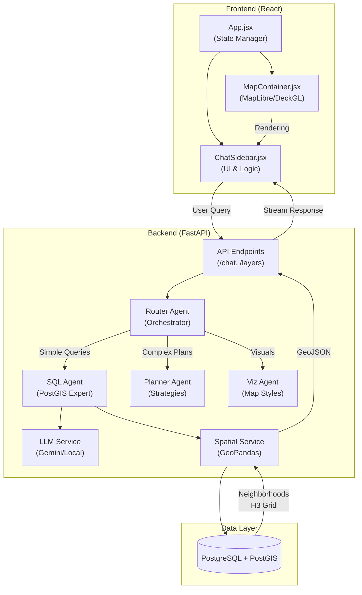

# HumanStreets System Architecture

This diagram illustrates the moving parts of the HumanStreets application, showing how the Frontend, Backend, Agents, and Database interact.

## Component Overview

1.  **Frontend**:
    *   **App.jsx**: Manages global state (theme, messages, map layers-to-show).
    *   **MapContainer**: Renders the interactive map using MapLibre (base) and DeckGL (data layers).
    *   **ChatSidebar**: Handles user input and displays streaming responses.

2.  **Backend**:
    *   **Router Agent**: Decides which specialized agent handles the request (e.g., "Show Malaz" -> SQL Agent).
    *   **SQL Agent**: Converts natural language to PostGIS SQL, executes it, and returns GeoJSON.
    *   **Planner Agent**: Breaks down complex tasks (e.g., "Find best place for...") into steps.

3.  **Data**:
    *   **PostgreSQL/PostGIS**: Stores spatial data (neighborhood bounds, walkability scores, H3 hexagons).
